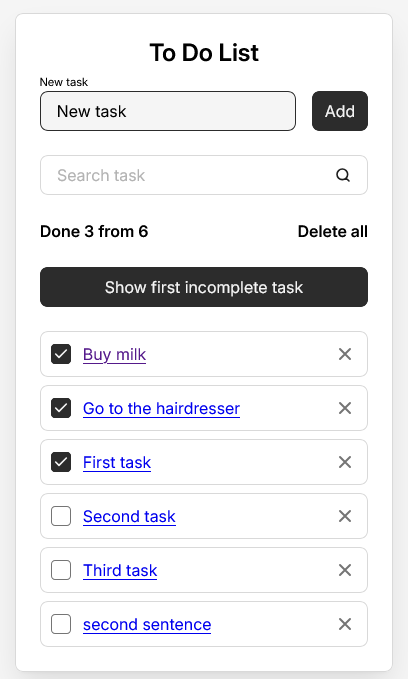
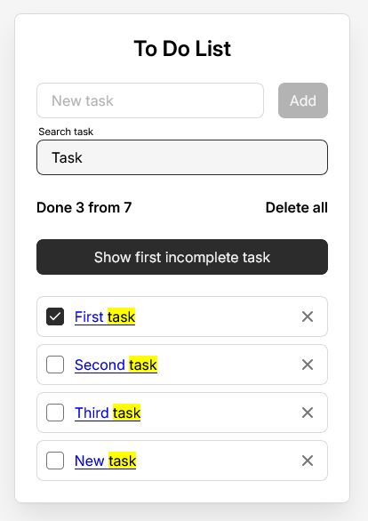

# 📝 Advanced Todo List App

## 📌 Overview
A feature-rich Todo List application built with React.  
The project demonstrates modern frontend development practices including modular architecture, state management, routing and performance optimization.

Users can manage tasks, search in real time, track progress and navigate between pages with tasks.

## 🚀 Demo
GitHub Pages ToDo Project: [Todo_form](https://aliangrey.github.io/Todo-form/)

---

### ➕ Add new task


### 🔍 Live search for tasks


### 📄 Task page with status


---

## ✨ Features

- ➕ Add new tasks  
- 🔍 Live search (case-insensitive)  
- 🗑 Delete single task  
- 🧹 Delete all tasks  
- ✅ Mark tasks as completed  
- 📄 View individual task page  
- 🧭 Multi-page navigation (React Router)  
- 🔝 Scroll to first incomplete task  
- 📊 Progress tracking (completed / total)  
- 💾 Persistent storage:
  - localStorage (client)
  - JSON Server (API simulation)
- ✨ Search highlighting  

---

## 🛠 Tech Stack

- React  
- Vite  
- Bun  
- JavaScript (ES6+)  
- React Router  
- JSON Server  
- localStorage  

---

## ⚛️ React Concepts Used

- useState  
- useEffect  
- useRef  
- useCallback  
- useMemo  
- useReducer  
- useContext  
- React.memo  

---

## 🧱 Architecture

The project follows a modular structure inspired by feature-based architecture:

- `entities` — business entities (Todo)
- `features` — user actions (add, search, stats)
- `widgets` — composed UI blocks
- `shared` — reusable components, utils and API
- `pages` — route-level components
- `app` — global configuration (routing, styles)

---

## 📂 Project Structure

```text
src/
  app/
    routing/
    styles/
    App.jsx

  entities/
    todo/
      model/
      ui/
        TodoItem/
        TodoList/

  features/
    add-task/
    search-task/
    stats/

  pages/
    TaskPage/
    TasksPage/

  shared/
    api/tasks/
    assets/icons/
    constants/
    ui/
      Button/
      Field/
      RouterLink/
    utils/

  widgets/
    Todo/

  main.jsx

index.html
vite.config.js
package.json
```

---

## 🔄 Data Management

The application supports two data modes:

- 🖥 Local Mode
Uses localStorage
Fast and no backend required

- 🌐 Server Mode
Uses json-server
Data stored in db.json

---

## ⚙️ Installation
```bash
bun install
```

---

## ▶️ Run project
Local mode:
```bash
bun run dev
```
Server mode:
```bash
npx json-server --watch db.json
```
---

## 📌 Purpose

This project was created to practice:

advanced React hooks
state management patterns
scalable project architecture
routing and page structure
performance optimization
working with API and local storage

---

## 📬 Contact
- GitHub: [AlianGrey](https://github.com/AlianGrey)
- LinkedIn: [LinkedIn Profile](https://www.linkedin.com/in/kostrikinaelena/)
- Email: ek371117@gmail.com